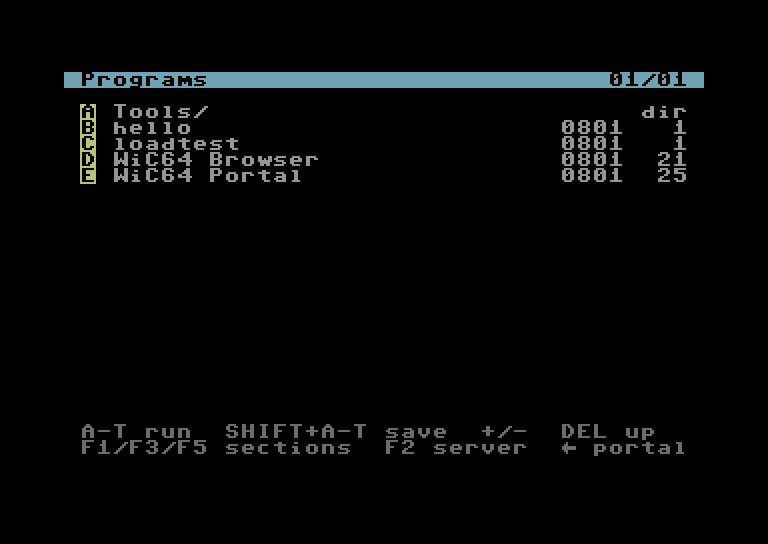
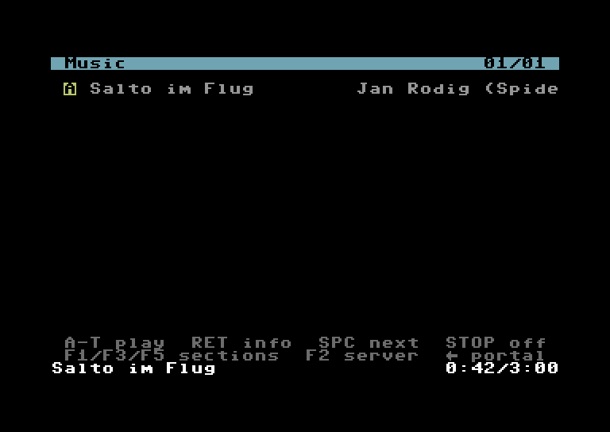
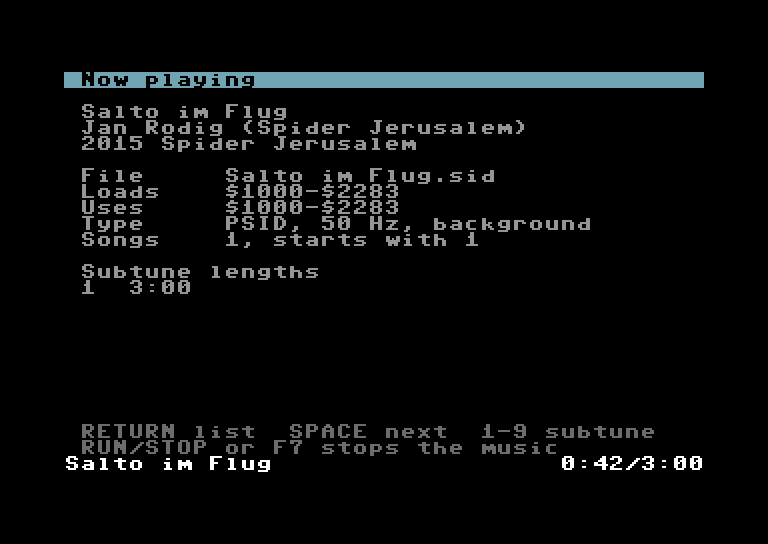
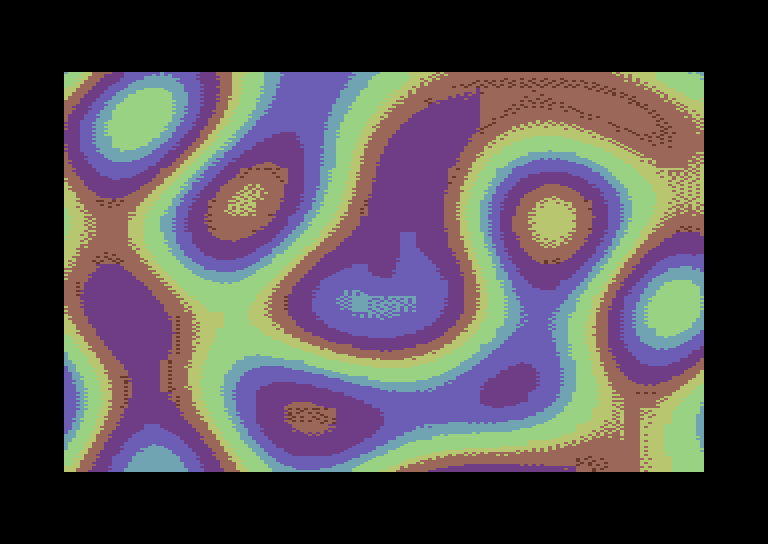
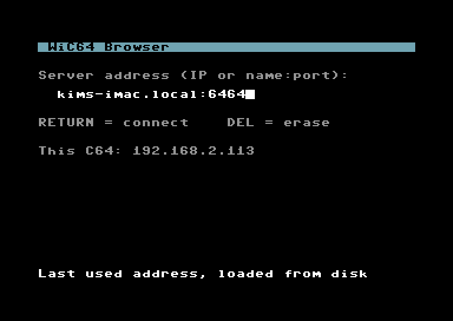
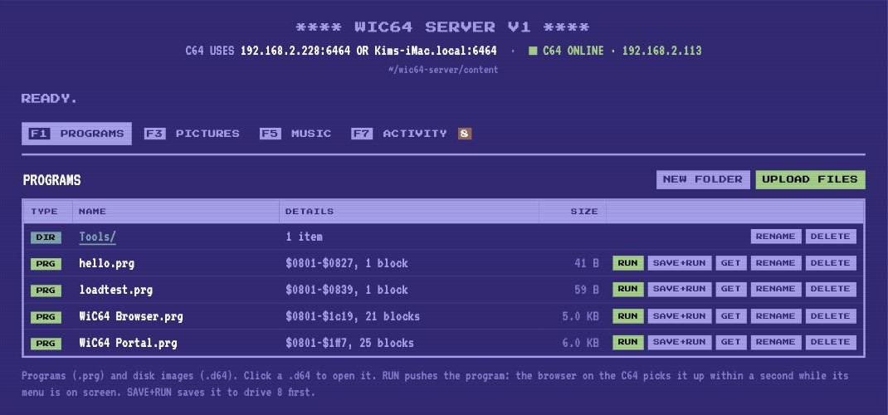
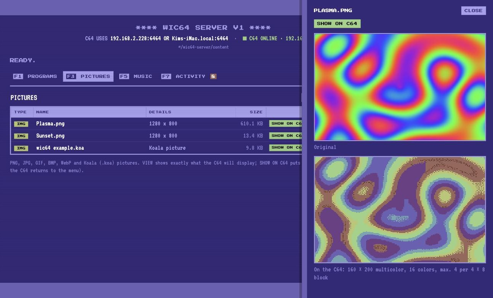
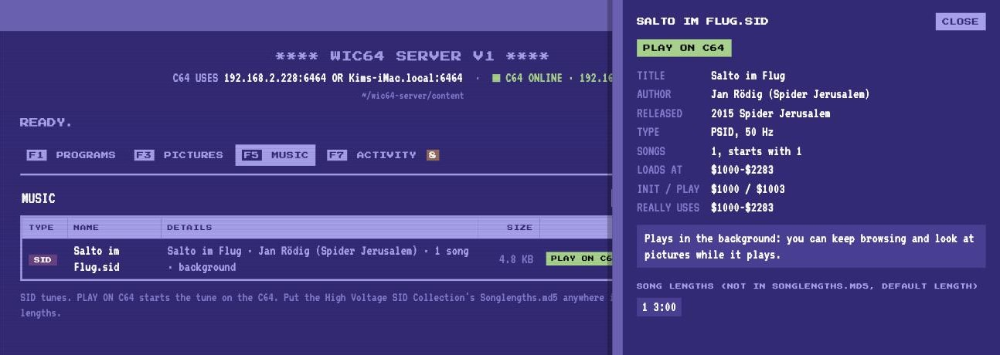
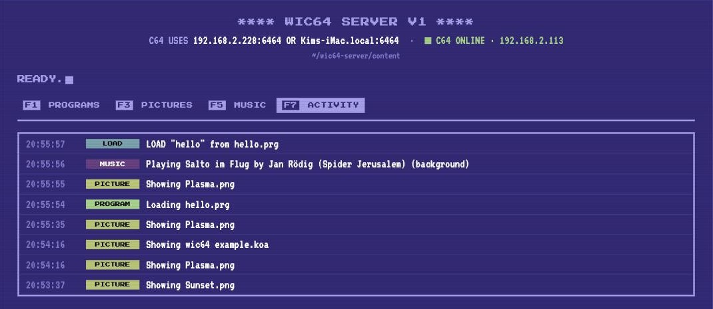

# WiC64 Browser

Browse, run, play and view the files on your computer from a **Commodore 64**, over WiFi with the
[WiC64](https://www.wic64.net) userport cartridge.

A small 6502 assembly program on the C64 talks to a .NET server on a Windows PC, Mac or Linux machine (even a Raspberry Pi). The server does all the heavy
lifting: it renders the menu screens, converts photos to C64 graphics, analyses SID tunes in a 6502 emulator,
reads `.d64` disk images and even serves files to games while they run. The C64 only copies bytes into memory.

```
┌─────────────┐  userport  ┌─────────┐  WiFi / HTTP  ┌─────────────────────┐       ┌─────────────┐
│ C64         │ ─────────► │ WiC64   │ ────────────► │ .NET server (PC)    │ ────► │ content/    │
│ browser.prg │ ◄───────── │ (ESP32) │ ◄──────────── │ port 6464 + web UI  │       │ prg img sid │
└─────────────┘            └─────────┘               └─────────────────────┘       └─────────────┘
```

## Screenshots

**On the C64:** the menu, a SID tune playing in the background, the tune's info screen, a photo converted to
multicolor, and the startup screen. These are pixel-exact renderings of what the browser shows: the server's real
screen data, drawn with the C64's character set, colors and border.

| Programs menu | Music with the time display |
|:---:|:---:|
|  |  |
| **Info screen of a tune** (RETURN) | **A picture, converted by the server** |
|  |  |
| **Startup screen** (address remembered on disk) | |
|  | |

**The web UI** at `http://localhost:6464/`:



| Picture preview: the original and the C64 version | SID info and PLAY ON C64 |
|:---:|:---:|
|  |  |



## Contents

- [Screenshots](#screenshots)
- [What it can do](#what-it-can-do)
- [Requirements](#requirements)
- [Getting started](#getting-started)
- [Windows and Linux](#windows-and-linux)
- [Using the browser on the C64](#using-the-browser-on-the-c64)
- [The web UI](#the-web-ui)
- [Pushing programs from the computer](#pushing-programs-from-the-computer)
- [Programs, disk images and the LOAD helper](#programs-disk-images-and-the-load-helper)
- [Music](#music)
- [Pictures](#pictures)
- [Configuration](#configuration)
- [How it works](#how-it-works)
- [Project layout](#project-layout)
- [Troubleshooting](#troubleshooting)
- [Limitations](#limitations)
- [Ideas for later](#ideas-for-later)
- [Credits and licenses](#credits-and-licenses)

## What it can do

**On the C64**

- **Programs:** run `.prg` files from the computer, loaded to their own address anywhere in `$0800-$cfff`.
- **Disk images:** open `.d64` images like folders and run the programs on them. Games with their own fast loader
  (most original commercial disks) don't work this way; see [Games with a fast loader](#games-with-a-fast-loader).
- **Multi-file programs:** a LOAD helper lets running programs `LOAD` more files from the server, including from
  the B side of a game, with the real drive as fallback.
- **Save to disk:** SHIFT+letter saves any program (also from inside a `.d64`) to drive 8, e.g. an SD2IEC.
- **Pictures:** PNG, JPG, GIF, BMP and WebP photos are converted to C64 multicolor with per-cell palettes and dithering.
  Koala (`.koa`) pictures are shown as they are.
- **SID music:**
  - Tunes play in the background while you keep browsing and looking at pictures.
  - The status line shows elapsed time and song length, and the next tune starts automatically.
  - An info screen shows author, year, subtune lengths and memory use.
  - Tunes that need the browser's memory, or run their own interrupts (RSID), play standalone.
- **Folders** in all sections, 20 entries per page.
- **Startup screen:** proposes the server's address (editable, remembered on disk) and shows the C64's own IP.
- **WiC64 portal:** one key away (←).

**On the computer**

- **Web UI** at `http://localhost:6464/`:
  - manage the files: upload by drag & drop, folders, rename, delete
  - preview pictures exactly as the C64 will show them
  - inspect SID tunes
  - push programs to the C64
  - follow a live activity log
- **`make push`:** send any `.prg` from the terminal to the C64 and run it within a second. Handy while developing
  C64 software: edit, assemble, run on real hardware, with no SD card juggling.

Everything above has been tested on a real C64 with a WiC64, except where [Limitations](#limitations) says otherwise.

## Requirements

- **A C64 with a WiC64** running firmware 2.x (legacy firmware is detected and reported). WiC64 emulation in
  VICE 3.8+ should work too, but hasn't been tested.
- **A computer** running Windows, macOS or Linux (x64 or ARM, also a Raspberry Pi) with:
  - [.NET 10 SDK](https://dotnet.microsoft.com/download)
  - [ACME](https://sourceforge.net/projects/acme-crossass/) cross assembler
  - `make` (to build the C64 programs; see [Windows and Linux](#windows-and-linux) for alternatives)

  Developed and tested on macOS; the server only uses cross-platform .NET and SkiaSharp (with native libraries
  for Windows, macOS and Linux), so it should run the same elsewhere, but that is untested so far.
- **Optional:** a drive on device 8 (1541, SD2IEC, ...) for saving programs.
- **Optional:** the High Voltage SID Collection's `Songlengths.md5` for correct song lengths.

## Getting started

```sh
make            # assemble the C64 programs into build/
make server     # build and start the server on port 6464 (keep this terminal open)
```

1. Put your files in the content folders:
   - `content/prg`: programs (`.prg`) and disk images (`.d64`)
   - `content/img`: pictures (`.png .jpg .jpeg .gif .bmp .webp .koa .kla`)
   - `content/sid`: SID tunes (`.sid`), optionally with `Songlengths.md5`

   Subfolders are fine. You can also upload through the web UI.
2. Get `build/browser.prg` onto the C64 once, for example via an SD2IEC, a 1541 Ultimate, or any WiC64 loader
   that can load a URL (the server serves it at `http://<mac>:6464/browser.prg`). Then `LOAD"BROWSER",8` and `RUN`.
3. The startup screen proposes `mypc:6464`. Replace it with your computer's address, e.g. `192.168.2.228:6464` or
   `Kims-iMac.local:6464` (the web UI's header shows both), and press **RETURN**. With a disk in drive 8 the browser
   remembers it for the next start.
4. When macOS asks whether the server may accept incoming network connections, allow it.

After the first time, save the browser to your own disk from the computer:
`make push PRG=build/browser.prg SAVE=1`.

## Windows and Linux

The server is plain .NET and runs the same on all three systems. The differences are in the tools around it:

| | Windows | Linux | macOS |
|---|---|---|---|
| .NET 10 SDK | installer from dotnet.microsoft.com | `dotnet-sdk-10.0` package or the install script | installer or `brew install dotnet` |
| ACME | download from SourceForge, put `acme.exe` on the `PATH` | `sudo apt install acme` (or build it from source) | `brew install acme` |
| `make` | Git Bash with `make`, MSYS2, or WSL | usually installed (`build-essential`) | Xcode command line tools |
| Firewall | allow "Wic64Server" when Windows asks | open port 6464 if a firewall is active | allow incoming connections when asked |

**Without `make`** (e.g. in PowerShell), first create `build/config.asm` with an editor. It holds the built-in server
address the browser proposes when there's no saved address on disk:

```
!macro server_address_text {
    !text "mypc:6464"
}
```

Then assemble and start everything by hand from the project folder:

```sh
acme -v1 -I c64 -I c64/wic64-library -I build -f cbm -o build/browser.prg c64/browser.asm
acme -v1 -f plain -o build/standalone.bin c64/standalone.asm
acme -v1 -f plain -o build/loadhelper.bin c64/loadhelper.asm
dotnet run --project server -- --Content=content --Build=build
```

Push a program with any HTTP tool, for example curl (included in Windows 10 and later):

```sh
curl --data-binary @mygame.prg "http://localhost:6464/push?name=mygame.prg&save=1"
```

`make IP=1` and `make BONJOUR=1` use macOS or Linux commands; on Windows use `make SERVER_HOST=...` instead.

## Using the browser on the C64

### Startup screen

It shows the proposed server address and the C64's own IP address. Both should be on the same network (same first
three numbers). Edit with DEL and the keys `0-9 . : -` and letters, then RETURN (max. 30 characters).

**The address is remembered on disk.** After RETURN, the browser saves the address in the SEQ file `WIC64 SERVER`
on device 8, if you changed it or it wasn't saved yet. The next start proposes it again ("Last used address,
loaded from disk"). Without that file, or without a drive, it proposes the built-in address, `mypc:6464` by
default. The address is not stored in the WiC64 itself. Typed it wrong? Press **F2** in the menu to get back to this screen.

Instead of an IP address you can use a name:

- **The computer's mDNS name**, e.g. `Kims-iMac.local:6464`: the Bonjour name on a Mac (System Settings → General →
  Sharing → Local hostname), `hostname.local` on Windows 10+ and on Linux with Avahi. The WiC64 firmware resolves
  `.local` names with multicast DNS, and the name stays the same when you switch WiFi networks. `make BONJOUR=1` makes it the built-in address.
- **A name from your router's DNS**, e.g. `mymac.lan:6464`, or any internet domain name.

The web UI shows both the IP address and the Bonjour name in its header.

### Menu

The server draws the whole menu screen: 20 entries per page, a title bar with the folder and page, and help lines.
Row 24 is the status line: messages, errors (in red) and the playing tune with its time.

| Key | Action |
|-----|--------|
| F1 / F3 / F5 | Programs / Pictures / Music |
| A–T | Open the entry: run a program, show a picture, play a tune, open a folder or `.d64` |
| SHIFT+A–T | Save the program to disk (device 8) |
| INST/DEL | Parent folder |
| + / - | Next / previous page |
| RETURN | Info screen of the playing tune (and back to the list) |
| SPACE | Next tune |
| 1–9 | Select a subtune of the playing tune |
| F7 or RUN/STOP | Stop the music |
| F2 | Change the server address (e.g. after a typo); saved to disk again |
| ← | Go to the WiC64 portal (the server fetches it from x.wic64.net) |
| any key | Back from a picture |

### Saving to disk

SHIFT+letter downloads the program and saves it to device 8 with its original load address. The status line then
shows the drive's own reply, for example:

- `00, ok,00,00`: saved.
- `63,file exists,00,00`: the name is taken. Nothing is overwritten; delete the old file with
  `OPEN15,8,15,"S:NAME":CLOSE15`.
- "Save failed - no drive 8?": no drive answered on device 8.

## The web UI

Open **http://localhost:6464/** on the computer while the server runs. It looks like a C64 screen: a boot banner with
the server address and the C64's status, READY. with a blinking cursor, sections as function keys
(**F1** programs, **F3** pictures, **F5** music, **F7** activity; on a Mac or laptop keyboard hold **fn**) and the C64's own colors.
It uses the "Press Start 2P" and "VT323" fonts from Google Fonts (without internet it falls back to a monospace font).

- **Programs / Pictures / Music:**
  - browse folders and open `.d64` images; the list shows load addresses and block counts
  - upload with the button or by dragging files onto the list
  - create folders, rename, delete (with confirmation), download
- **RUN / SAVE+RUN:** pushes a program, also from inside a `.d64`, to the browser on the C64.
- **SHOW ON C64 / PLAY ON C64:** shows a picture on the C64's screen (any key returns to the menu) or plays a tune,
  from the list or the preview panel. A pushed tune gets the same time display, info screen and auto-next as one
  picked on the C64.
- **Preview:**
  - pictures: the original next to the C64 version, exactly what the C64 will display
  - SID tunes: title, author, year, type, song lengths, the memory the tune really uses, and whether it plays in the
    background or standalone
- **Status bar:**
  - whether the C64 is online, and its IP address
  - the address to type on the C64
  - a waiting push, which can be cancelled
- **Activity:** a live log of what the C64 does: menus, programs, pictures, tunes, LOADs by running programs, pushes,
  uploads and deletes.

The web UI can delete files, so it **only answers on the computer the server runs on**: other computers get HTTP 403.
The C64's addresses are not affected. To manage the files from another computer or a tablet, start the server with
`--AllowRemoteAdmin=true`, but anyone on your network can then manage the files. File paths are always checked
against the content folder.

## Pushing programs from the computer

```sh
make push                                # sends content/prg/hello.prg
make push PRG=path/to/program.prg        # the C64 loads and runs it within a second
make push PRG=path/to/program.prg SAVE=1 # ... after saving it to device 8
```

Or use **RUN** in the web UI (and **SHOW ON C64** / **PLAY ON C64** for pictures and tunes). While its menu is on screen, the browser asks the server once a second whether
something was pushed (with a 2-second timeout; a failed check is silent and retried after about 5 seconds). The pushed program runs instead of the browser, so for the next push, reset the C64 and start
the browser again.

A typical development loop for your own C64 program:

```sh
acme -f cbm -o build/mygame.prg mygame.asm && make push PRG=build/mygame.prg
```

To update the browser itself: `make && make push PRG=build/browser.prg SAVE=1`.

## Programs, disk images and the LOAD helper

**Loading.** Programs load to their own address, like `LOAD"...",8,1`, anywhere in `$0800-$cfff`:

- Programs loaded at `$08xx` are started with `RUN`; others with a jump to their load address.
- Programs that extend over the browser (`$c000-$cfff`) are received in two steps: everything below `$c000` first,
  then a tiny starter in the stack page receives the rest, resets the machine and starts the program.

**Disk images.** `.d64` files (35 or 40 tracks) in `content/prg` open like folders and show their PRG files.
Their programs run, save and push just like normal `.prg` files. The browser does not emulate a disk drive: it
loads *files* from the image. Games that need the drive itself don't run (see below).

**The LOAD helper.** Programs started from the browser get a small helper (`c64/loadhelper.asm`) in the KERNAL LOAD
vector. Every `LOAD` from device 8 asks the server first:

- It looks in the `.d64` image or folder the menu showed when the program started.
- Then in the other `.d64` images in the same folder, so a game can load from its B side.
- Wildcards work (`LOAD"*",8`, `LOAD"LEVEL?",8,1`), and `LOAD"$",8` returns a real directory listing.
- Files the server doesn't have are loaded from the real drive as usual.

This works for programs that load through the KERNAL: most BASIC programs, many simpler games and many cracked
versions. Try `loadtest` in the Programs menu: it is two lines of BASIC that `LOAD"HELLO",8` from the server.

### Games with a fast loader

Many games, especially original commercial disks, **can't be run from a `.d64` through the browser**. They only load
a small first file the normal way. That file starts the game's own fast loader, which is sent into the disk drive
and reads the rest of the game straight from the disk's sectors. Often that data isn't stored as files at all.
Neither the browser nor the LOAD helper sees those reads: there is no disk drive with that `.d64` inserted, only the
server, which serves whole files.

Typical signs:

- The directory shows only one or two small files, while the disk is (nearly) full. Skate or Die, for example, has
  a 53-block `SKATE OR DIE` and a 2-block `EA` on side A, but 0 blocks free; side B has no files at all.
- The first file starts and then hangs, or shows "loading" forever.
- The activity log in the web UI shows one or two LOADs, then nothing more.

What works for these games:

- **Drive emulation:** a 1541 Ultimate, Ultimate 64, Kung Fu Flash or Pi1541 emulates a complete 1541 including its
  CPU, so fast loaders work. Put the `.d64` on its SD card or USB stick.
- **A real 1541** with the image written to a floppy (e.g. with a ZoomFloppy, or a disk copy program on the C64).
- **SD2IEC** supports some well-known fast loaders, but not all.
- **A single-file version:** many games exist as "onefile" cracks (e.g. on [CSDb](https://csdb.dk)). A single `.prg`
  loads fine through the browser.

The server's activity log shows every LOAD, which makes it easy to see where a game takes over with its own loader.

## Music

**How tunes are played.** Before a tune is sent, the server runs its init routine and a few seconds of every subtune
in a built-in 6502 emulator (`server/Cpu6502.cs`) and records the memory the tune really writes. Many tunes unpack
data far outside the range they load to. Based on that, a tune:

- **plays in the background** when it leaves the browser alone. The browser plays it from a raster interrupt
  (50 Hz), or from the CIA timer when the SID file asks for it. You can keep browsing and look at pictures; if a
  picture would overwrite the tune, the music stops first.
- **plays standalone** when it needs the browser's memory (`$0400-$07ff`, `$c000-$cfff`), or installs its own
  interrupt (all RSID tunes). The server sends a tiny player to the cassette buffer (`$0334`); it receives the tune
  itself (even over the browser) and plays it. 1–9 still selects subtunes; reset the C64 to return.
- **is rejected** when it loads outside `$0400-$cfff`, is a BASIC RSID, or overwrites the player at `$0334`.

**Time, auto-next and the info screen.** The status line shows `0:42/3:15`, elapsed time and song length. When the
time is up, the next tune in the folder that plays in the background starts; SPACE skips to it right away. RETURN
shows an info screen with author, year, memory use, playback mode and the lengths of subtunes 1–9.

**Song lengths.** Copy `Songlengths.md5` from the High Voltage SID Collection (`C64Music/DOCUMENTS/`) anywhere into
`content/sid`. Tunes it doesn't know play for 3 minutes (`--SidDefaultSeconds=...`).

## Pictures

The server converts pictures on the fly and caches the result until the file changes:

1. Fit the image into 320×200 (letterboxed in black) and scale it to 160×200 "fat" multicolor pixels.
2. Pick the background color that most pixels are closest to.
3. For each 4×8 cell, try all 455 combinations of three more colors and keep the best.
4. Floyd–Steinberg dither the image with each pixel limited to the four colors of its cell. Colors use the Pepto
   PAL palette and a perceptual ("redmean") distance.

A 5120×2880 JPG converts in about a second. The C64 receives 10 KB of Koala data and shows it from VIC bank 1
(`$4400` screen, `$6000` bitmap), so the menu and a tune playing in the background stay intact.

## Configuration

**Make variables**

| Variable | Default | Meaning |
|----------|---------|---------|
| `SERVER_HOST` | `mypc` | Built-in address (IP or name), proposed when there is no `WIC64 SERVER` file on the disk |
| `BONJOUR=1` | | Built-in address = this computer's mDNS name (`Kims-iMac.local`) |
| `IP=1` | | Built-in address = this computer's current IP address (macOS and Linux) |
| `PORT` | `6464` | Server port |
| `PRG`, `SAVE` | `content/prg/hello.prg`, `0` | For `make push` |
| `VICE`, `VICEFLAGS` | `x64sc`, `-userportdevice 23` | For `make vice` |

**Server settings** are in `server/appsettings.json`:

```jsonc
{
  "Content": "content",          // folder with prg/, img/ and sid/
  "Build": "build",              // browser.prg, standalone.bin and loadhelper.bin from make
  "Port": 6464,
  "SidDefaultSeconds": 180,      // play length of tunes that are not in Songlengths.md5
  "AllowRemoteAdmin": false      // allow the web UI from other computers
}
```

- Relative folders are relative to the **project folder** (the one with the Makefile), however the server is
  started. Absolute paths work too, e.g. `"Content": "/Users/Kim/C64/content"` or `"D:\\C64\\content"` on Windows.
- A missing `prg/`, `img/` or `sid/` inside the content folder is created at startup. If the content folder itself
  doesn't exist, the server log and the web UI say so.
- Every setting can be overridden on the command line: `dotnet run --project server -- --Content=/other/folder --Port=6465`
  (with `make server`, only `PORT=...`).
- Restart the server after changing the file (`make server` rebuilds, which copies the file next to the executable).

## How it works

### Division of work

The C64 has 64 KB and a 1 MHz CPU, so the server prepares everything in the exact byte layout the C64 needs:

| The server... | The C64... |
|---------------|------------|
| renders each menu as 1000 screen codes | copies them to `$0400` |
| converts pictures to Koala data | copies them to the VIC's memory |
| analyses SID tunes and sends load/init/play addresses, lengths and the mode | loads the tune and calls `init`/`play` |
| builds the standalone player and the LOAD helper | stores them and jumps to them |
| reads `.d64` images and matches file names | receives a plain `.prg` |

### Protocol

Plain HTTP GET via the WiC64's `HTTP_GET` command, using the official
[WiC64 library](https://github.com/WiC64-Team/wic64-library). Folders are 4 hex digits; pages and entries are 2.
Most responses start with a status byte: `$00` = OK, followed by the payload; `$01` = error, followed by a
40-character screen-code line that the C64 shows in its status line.

| URL | Response |
|-----|----------|
| `/m/{p\|i\|s}/{folder}/{page}` | entries, pages, parent folder, folder ids of the entries, 1000 screen codes |
| `/p/{folder}/{page}/{entry}` | name length, 16-byte PETSCII name, the `.prg` (load address first) |
| `/i/{folder}/{page}/{entry}` | 8000 bitmap + 1000 screen RAM + 1000 color RAM + 1 background |
| `/s/{folder}/{page}/{entry}` | 37-byte header (incl. the tune's own folder/page/entry), 40-char "now playing" line, standalone player (if needed), tune data |
| `/v/{folder}/{page}/{entry}` | info screen of a tune (1000 screen codes) |
| `/x` | is something pushed? 0 = no, 1 = run, 2 = save + run, 3 = show picture, 4 = play tune |
| `/x/p`, `/x/i`, `/x/s` | the pushed program, picture or tune, in the same format as `/p`, `/i` and `/s` |
| `/h` | LOAD helper code for `$02a7` and `$0334` |
| `/l/{folder}/{name in hex}` | a file for the LOAD helper, or only status `$01` (then the real drive is used) |
| `/o` | the WiC64 portal, fetched from x.wic64.net (keeps the browser small) |
| `/browser.prg` | the browser itself |
| `POST /push?name=..&save=1` | queue a `.prg` for the C64 (used by `make push`) |
| `/`, `/api/...` | web UI and its JSON API (only from the computer itself) |

### C64 memory map

| Range | Use |
|-------|-----|
| `$0100-$0174` | Starter: receives the end of a program over the browser and starts it |
| `$0200-$0258` | WiC64 request header and URL (BASIC input buffer); used by the LOAD helper too |
| `$02a7-$02ff` | Message line and folder ids; part of the LOAD helper while a program runs |
| `$0334-$03fb` | Standalone SID player or LOAD helper (both sent by the server) |
| `$0400-$07e7` | Menu screen (row 24 = status line) |
| `$0800-$bfff` | Free for tunes playing in the background |
| `$0800-$cfff` | Programs are received to their load address |
| `$4400`, `$6000` | Picture screen RAM and bitmap (VIC bank 1) |
| `$c000-$cfff` | The browser, copied there from `$0801` at startup |
| `$d000-$d4ff` | RAM under the I/O area: copy of the startup code (address screen), for F2 |

The browser uses no zeropage, so SID tunes can use any zeropage location. The one-time startup code (WiC64
detection, address screen) runs from where the program was loaded and doesn't take space at `$c000`.

## Project layout

```
Makefile                   build, run the server, push, VICE
README.md
c64/
  browser.asm              the C64 browser (ACME)
  standalone.asm           SID player for tunes that need the browser's memory
  loadhelper.asm           LOAD from device 8 via the server, for multi-file programs
  samples/hello.asm        tiny BASIC program for testing pushes
  samples/loadtest.asm     BASIC program that LOADs "HELLO" through the LOAD helper
  wic64-library/           official WiC64 library (BSD license, see VERSION)
server/                    ASP.NET Core minimal API (.NET 10)
  Program.cs               startup: settings, services, access rules, endpoints
  ServerOptions.cs         settings (port, content and build folders, song length, remote admin)
  Api/
    C64Endpoints.cs        the C64 protocol (menus, programs, pictures, tunes, pushes, LOAD helper)
    C64Response.cs         status byte + payload / error line, program responses, URL parsing
    AdminEndpoints.cs      JSON API for the web UI
    AccessRules.cs         web UI only from this computer; tracks when the C64 was last seen
  Content/
    Catalog.cs             folders and .d64 images as menu entries, folder ids
    DiskImage.cs           .d64 reader
    Petscii.cs             PETSCII file names
  Programs/
    PushQueue.cs           what was pushed: a program, picture or tune
    LoadService.cs         files and directory listings for the LOAD helper
  Pictures/
    KoalaConverter.cs      image -> multicolor bitmap (per-cell palette + dithering)
    PictureService.cs      picture cache and PNG previews
  Music/
    SidFile.cs             PSID/RSID parser
    Cpu6502.cs             6502 emulator
    SidAnalyzer.cs         decides background / standalone / rejected
    SidService.cs          SID header, standalone player, next tune, info screen
    SongLengths.cs         Songlengths.md5 database
  Screens/
    ScreenCodes.cs         text -> C64 screen codes
    Screen.cs              a 40x25 screen
    MenuScreen.cs          the browser's menu screen
  Activity/
    ActivityLog.cs         recent C64 activity for the web UI
  wwwroot/                 the web UI (index.html, ui/app.js, ui/app.css)
content/                   your files: prg/, img/, sid/
build/                     generated by make (browser.prg, standalone.bin, loadhelper.bin, config.asm)
```

## Troubleshooting

| Symptom | Cause and fix |
|---------|---------------|
| A network error (e.g. "Failed to open connection") or a timeout right after startup with a name | The WiC64 could not resolve the name. Try the IP address; for `.local` names the computer and the C64 must be on the same network. |
| "Timeout: is the server on? F2 = address" | The server is not running, or the C64 can't reach it. Press F2 to check or correct the address. Check the address on the startup screen, that the C64's IP is in the same network, and that the firewall allows the server. |
| `404 Not Found` on the C64 | The server is older than the browser. Restart it: Ctrl+C, then `make server`. |
| "No WiC64 found" | The WiC64 is not plugged in or not responding; power-cycle it. |
| "Please update the WiC64 to firmware 2.x" | Legacy firmware; update it via the WiC64 portal. |
| A push is not picked up | The browser only checks while its menu is on screen. Failed checks are silent and retried after about 5 seconds. The web UI shows whether a push is waiting and when the C64 was last seen. |
| "Timeout" after the browser ran for a while | Browsers from before the silent background check showed a timeout when a single check was slow; update the browser. A timeout now only appears for things you do (menus, programs, pictures, tunes). |
| `?SYNTAX ERROR` after starting a program | A browser from before the load-address fix; update the browser. |
| A game from a `.d64` starts but hangs while loading | It uses its own fast loader, which needs a real (or emulated) drive; see [Games with a fast loader](#games-with-a-fast-loader). The activity log shows the last LOAD. |
| A tune plays too fast or too slow | Timing is for a PAL C64 (50 Hz). NTSC machines play standalone tunes too slowly. |
| Web UI answers "only works on the computer the server runs on" | Use `http://localhost:6464/` on that computer, or start the server with `--AllowRemoteAdmin=true`. |

## Limitations

- **Memory:** programs must fit in `$0800-$cfff`. Programs that run over `$c000` can be started but not saved from
  the browser.
- **Programs not loaded at `$08xx`:** started with a jump to their load address, which isn't always the right entry
  point.
- **No drive emulation:** games with their own fast loader (most original commercial disks) don't run from a `.d64`;
  only files loaded through the KERNAL are served. See [Games with a fast loader](#games-with-a-fast-loader).
- **Disk formats:** SEQ/USR/REL files and other formats (`.d71`, `.d81`, `.t64`) are not supported yet.
- **LOAD helper memory:** the helper lives in `$0200-$0258`, `$02a7-$02ff` and `$0334-$03fb`. Programs that use that
  memory overwrite it, and their LOADs then go to the real drive.
- **SID playback:**
  - SID files with 2 or 3 SID chips play only the first chip.
  - Tunes whose play routine needs a speed other than 50 Hz or the default CIA timer play at the wrong speed.
  - Timing assumes a PAL C64.
- **Browser space:** the browser's `$c000-$cfff` block is full. New C64 features need a modular structure, e.g.
  loading parts from the server on demand.
- **Tested on real hardware:** browsing, running (incl. `.d64` and Bubble Bobble 2), the LOAD helper, push, saving,
  background and standalone music. Not yet: programs larger than `$c000`, auto-next after the full song length,
  the info screen, VICE.

## Ideas for later

- **Modular browser:** features loaded from the server on demand, so the C64 side can keep growing.
- **Disk images:** `.t64`/`.d71`/`.d81`, SEQ files, and a writable virtual drive (SAVE to the computer).
- **Search:** type a few letters to find a tune in the full High Voltage SID Collection.
- **Playlists:** jukebox and slideshow modes (pictures cycling while music plays).
- **Computer dashboard:** clock, calendar, now playing on Spotify/Music, with remote control from the C64.
- **Online content:** weather, news and RSS rendered as 40-column pages; an AI chat on the C64.
- **Multiplayer:** chat and turn-based games between C64s over the WiC64's TCP support.
- **Screenshots:** grab the C64's screen to a PNG on the computer.

## Credits and licenses

This project is licensed under the [MIT License](LICENSE), except for the parts below that keep their own license.


- [WiC64](https://www.wic64.net) and the [WiC64 library](https://github.com/WiC64-Team/wic64-library) by the WiC64
  team: BSD license, included in `c64/wic64-library`.
- [SkiaSharp](https://github.com/mono/SkiaSharp) for image decoding and PNG previews: MIT license.
- C64 colors: the "Pepto" PAL palette.
- SID file format and `Songlengths.md5`: [High Voltage SID Collection](https://www.hvsc.c64.org).
